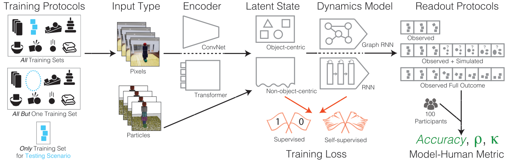

# physopt

## Overview

The goal of this repository is to train and evaluate different physics prediction models under various pretraining and readout protocols. The procedure consists of three phases, as follows:

1. **Pretraining**: Train the physics prediction model on its specific prediction task on the specific train dataset.
2. **Extraction**: Extract model features for the readout training and testing datasets.
3. **Readout**: Train a model to predict the task labels using extracted features, and evaluate the trained readout model on the readout test set.

Runs and artifacts from running the pipeline are recorded with [MLflow](https://mlflow.org/).

## How to Install
**Recommended**: Create a virtualenv with `virtualenv -p python3 .venv` and activate it using `source .venv/bin/activate`. Note that you will likely run into issues if you use python3 if it is an older version. python3.5 may cause issues while python3.7 appears to be fine. You may be able to find later python versions in /usr/bin.

Run `pip install -e .` in the root `physopt` directory to install the `physopt` package. You will also need to install the correct version of PyTorch for your system, see [this link](https://pytorch.org/get-started/locally/) for instructions.

In order to use PostgreSQL as the MLflow backend store, you'll need to install postgresql with `sudo apt-get install postgresql`, if it's not installed already -- you can check with `psql --version`.

## How To Run

### Local
To run, use `run` from `physopt.opt`. The only required commandline argument is  `--config` or  `-C`, which should point to the `.yaml` config file (see [Configuration](#configuration)). Optionally, you may also choose to specifiy the output directory where the results are saved (with `--output` or `-O`).

For convenience, you can use the following environment variables: `PHYSOPT_CONFIG_DIR`, which specifies the directory to look for configs if passed a relative path, and `PHYSOPT_OUTPUT_DIR`, which specifies the output directory to use if none is specified in the commandline. Also, `setup_environment_vars` is also provided in `physopt.opt` which allows you to specify the environment variables using a `.yaml` file.

Local files will be saved to `[OUTPUT_DIR]/[DBNAME]` and MLflow files will be saved in the `[OUTPUT_DIR]/[DBNAME]/mlruns` subdirectory.

### Remote MLflow Tracking Server
MLflow allows for using a remote Tracking Server. Specifically, we use a Postgres database for backend entity storage and an S3 bucket for artifact storage. This requires setting up PostgreSQL and Amazon S3 as detailed in the [Setup](#setup) section above. The relevant cofig file settings are `HOSTPORT` (format `host:port`)  and `DBNAME` (default: `physopt`).

## Configuration 
The default configuration can be found in `physopt/config.py`, which is updated by specifying a YAML configuration file using the `--config` (or `-C`) commandline argument. The following are required:
- `DATA_SPACE.MODULE` (see [data spaces specification](#data-spaces-specification))
- `PRETRAINING.OBJECTIVE_MODULE` (see [model specification](#model-specification))
- `PRETRAINING.MODEL_NAME` 
- `EXTRACTION.OBJECTIVE_MODULE` (see [model specification](#model-specification))
- `READOUT.OBJECTIVE_MODULE` (see [model specification](#model-specification))

### Data Spaces Specification
The `DATA_SPACE.FUNC` (defaults to `get_data_spaces`) from the specified `DATA_SPACE.MODULE` must return a list of dicts with the following structure:
- `pretraining`: dict with `name`, `train`, and `test` that specify the dataset/scenario name, train datapaths, and test datapaths, respectively
- `readout`: a list of dicts, with each dict having the same format as in `pretraining` but specifying data for readout phase instead

Any `kwargs` for `DATA_SPACE.FUNC` can be specified using `DATA_SPACE.KWARGS`.

The seeds, specified by `DATA_SPACE.SEEDS`, should  be a list  of seeds to use. Each set of pretraining and readout datasets (i.e. each element of the list of dicts returned by `DATA_SPACE.FUNC`) will be run with each seed.

An example of how the data spaces can be constructed can be found in the [physics-models](https://github.com/neuroailab/physics-models/tree/master/physion/data_space) repo.

###  Model Specification
Running a model in `physopt` requires creating an Objective class for each phase (pretraining, extraction, and readout), specified by `[PHASE].OBJECTIVE_MODULE` and `[PHASE].OBJECTIVE_NAME` in the config. 

Your `PretrainingObjective` should inherit from `PretrainingObjectiveBase` ([link](https://github.com/neuroailab/physopt-physics-benchmarking/blob/main/physopt/objective/base.py#L17)) and requires implementing the following methods:
- `get_pretraining_dataloader`: Takes as input params a list of `datapaths` and a bool `train` flag. Returns the dataloader object that can be iterated over for batches of data
- `train_step`: Takes as input a batch of data, performs the train optimization step, and returns the scalar loss value for that step
- `val_step`: Takes as input a batch of data, performs validation on that batch, and returns the scalar metric used for validation

Your `ExtractionObjective` should inherit from `ExtractionObjecitveBase` and requires implmenting the following methods:
- `get_readout_dataloader`: Takes as input params a list of `datapaths`. Returns the dataloader object that can be iterated over for batches of data
- `extract_feat_step`: Takes as input a batch of data, and outputs a dict with `input_states`, `observed_states`, `simulated_states`, `labels`, and `stimulus_name`

A simple logistic regression readout model is provided in [physics-models](https://github.com/neuroailab/physics-models/blob/master/physion/objective/objective.py), but a different `ReadoutObjective` can be used by inheriting from `ReadoutObjectiveBase` and implementing:
- `get_readout_model`: Returns a model object that has the following methods: `fit`, `predict`, and `predict_proba`.

The `PretrainingObjective` and `ExtractionObjective` both also inherit from `PhysOptModel`, which requires implementing:
- `get_model`: Returns the model object
- `load_model`: Implements loading of the model given a model checkpoint file
- `save_model`: Implements saving of the model given a model checkpoint file

An example can be found [here](https://github.com/neuroailab/physics-models/blob/fe10826dffef59bd866f388202b6dadc5b3f91d4/physion/models/frozen.py).

## Setup
### PostgreSQL
Connect to the PostgreSQL server using `sudo -u postgres psql`. You should see the prompt start with `postgres=#`. Next, create a user with username and password "physopt" using `CREATE USER physopt WITH PASSWORD 'physopt' CREATEDB;`. Verify that the user was created successfully with `\du`. 

You can change the port by changing the setting in the `postgresql.conf` file, whose location can be shown using `SHOW config_file;`. After you change `postgresql.conf` make sure to restart the server using `sudo service postgresql restart`. You can check what port is being used with `\conninfo` after connecting to the server.

### Amazon S3
In order to use S3 as the MLflow artifact store, you'll need to add your AWS credentials to `~/.aws/credentials`. See [this link](https://docs.aws.amazon.com/cli/latest/userguide/cli-configure-files.html) for more information about the AWS credential file.

### MLflow Tracking UI
To view the MLflow tracking UI run `mlflow ui`. If you are using local storage add `--backend-store-uri file:///[OUTPUT_DIR]/mlruns`. Otherwise, if you're using the PostgreSQL backend add `--backend-store-uri postgresql://<username>:<password>@<host>:<port>/<database>`. Finally, navigate to `http://localhost:5000`.

#### Notes
If the machine running the MongoDB, PostgreSQL, and MLflow tracking servers is not publicly visible, you'll need to setup the necessary ssh tunnels.

## Using external models 
If you've trained a model for forward prediction using your own external code-base and want to evaluate it on our benchmark, please refer to the following steps.
- Set `SKIP_PRETRAINING = True` in `physion.yaml`
- Specify a path to the config file pertaining to your external repository in the `PRETRAINING.MODEL.CUSTOM_CONFIG` field of `physion.yaml`. This file should contain the requisite parameter specifications for creating your model. Your config dict will now be stored in `PRETRAINING.MODEL`.
- Define your `model`: implement the `get_model` function by instantiating your model using the configs listed in `PRETRAINING.MODEL` and loading the pretrained weights. 
- See [`physics-models/configs/fitvid.yaml`](https://github.com/neuroailab/physics-models/blob/master/configs/FitVid/fitvid.yaml) and [`physics-models/configs/physion_only_test.yaml`](https://github.com/neuroailab/physics-models/blob/master/configs/FitVid/physion_only_test.yaml) for an example of how to create these configs. [`physics-models/physion/objective/FitVidExt.py`](https://github.com/neuroailab/physics-models/blob/master/physion/objective/FitVidExt.py) lists an example of how an external model can be defined. 
  
## Example
- Download example (physion) data from [here](https://physics-benchmarking-neurips2021-dataset.s3.amazonaws.com/physion_example_data.zip).
- Install [physopt](https://github.com/neuroailab/physopt-physics-benchmarking) (if not already done)
- Install [physics-models](https://github.com/neuroailab/physics-models) (if not already done).
- Update data directory in [example config](https://github.com/neuroailab/physics-models/blob/master/configs/example.yaml).
- Set the path to your configs and results directory in the `environment.yml` file of the `physics-models` repo. Please refer to the instructions provided in the file. 
- In `physics-models` directory, run `python run.py -C [path_to_example_config]`. Or write your own run script based on [run.py](https://github.com/neuroailab/physics-models/blob/master/run.py).

## Citing Physion

If you find this codebase useful in your research, please consider citing:

    @inproceedings{bear2021physion,
        Title={Physion: Evaluating Physical Prediction from Vision in Humans and Machines},
        author= {Daniel M. Bear and
               Elias Wang and
               Damian Mrowca and
               Felix J. Binder and
               Hsiao{-}Yu Fish Tung and
               R. T. Pramod and
               Cameron Holdaway and
               Sirui Tao and
               Kevin A. Smith and
               Fan{-}Yun Sun and
               Li Fei{-}Fei and
               Nancy Kanwisher and
               Joshua B. Tenenbaum and
               Daniel L. K. Yamins and
               Judith E. Fan},
        url = {https://arxiv.org/abs/2106.08261},
        archivePrefix = {arXiv},
        eprint = {2106.08261},
        Year = {2021}
    }
